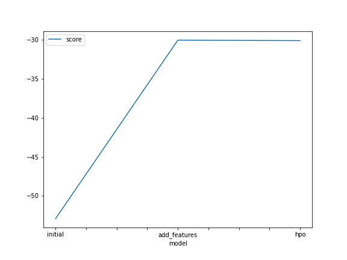
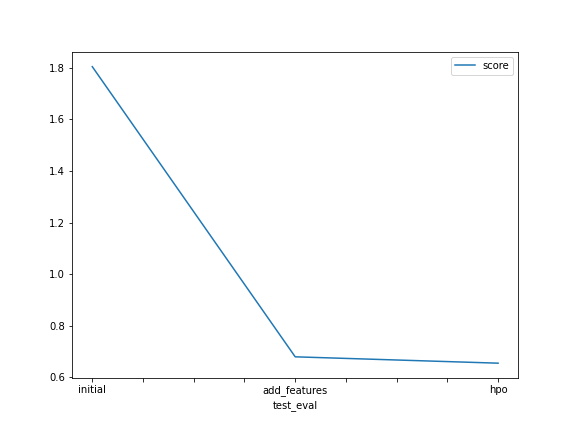

# Report: Predict Bike Sharing Demand with AutoGluon Solution
#### NAME HERE

## Initial Training
### What did you realize when you tried to submit your predictions? What changes were needed to the output of the predictor to submit your results?
The forecasted values should be non-negative. The negative forecasts need to be set to 0. 

### What was the top ranked model that performed?
The top ranked model is WeightedEnsemble_L3, which got kaggle score of 1.80438.

## Exploratory data analysis and feature creation
### What did the exploratory analysis find and how did you add additional features?
Season and weather should be categorical features, not numerical.
I created hour feature from the datetime. 

### How much better did your model preform after adding additional features and why do you think that is?
The kaggle score improved by 1.12 (1.80438 - 0.68008). Bike demand is the time series with the seasonality of hour, dayofweek, week, etc. So hour is a useful feature and can improve model performance. 

## Hyper parameter tuning
### How much better did your model preform after trying different hyper parameters?
HPO improved kaggle score by 0.02 (0.68008 - 0.65546). 

### If you were given more time with this dataset, where do you think you would spend more time?
I'll try to add more features (dayofweek, week, month, and so on). Then try hyperparameter tuning for specific models including neural network, gradient boosting algorithm.

### Create a table with the models you ran, the hyperparameters modified, and the kaggle score.
|        model | num_bag_folds | num_bag_sets | time_limit |   score |
|-------------:|--------------:|-------------:|-----------:|--------:|
|      initial |       default |      default |        600 | 1.80438 |
| add_features |       default |      default |        600 | 0.68008 |
|          hpo |            15 |           15 |        900 | 0.65546 |

### Create a line plot showing the top model score for the three (or more) training runs during the project.

### Create a line plot showing the top kaggle score for the three (or more) prediction submissions during the project.

## Summary
Bike Sharing Demand Predicting is a regression problem, and `TabularPredictor` in `autogluon` is used to train and predict. Without any data processing, the initial model got score of 1.80438. After adding additional feature `hour`, and revise data type of `season` and `weather`, the score is improved to 0.68008. Finally with hyperparameter tuning of `num_bag_folds`, `num_bag_sets` and `time_limit`, the score is improved further by 0.02. The next steps could be to add more features, and tune hyperparameters of specific models.  
